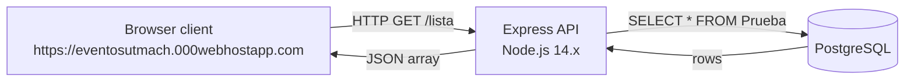

The Eventos API is a lightweight REST API built for the UTMACH events platform. It exposes participant data stored in a PostgreSQL database to authorized front-end clients, enabling event listings and attendee management through simple HTTP requests.

<CardGroup cols={2}>
  <Card title="Get started" icon="rocket" href="/quickstart">
    Run the API locally and make your first request in minutes.
  </Card>
  <Card title="List participants" icon="users" href="/quickstart#test-the-endpoint">
    Query the `/lista` endpoint to retrieve all event participants.
  </Card>
  <Card title="Node.js + Express" icon="node-js">
    Built on Node.js 14.x with Express 4.x for routing and middleware.
  </Card>
  <Card title="PostgreSQL" icon="database">
    Participant data is persisted in a PostgreSQL database accessed via the `pg` connection pool.
  </Card>
</CardGroup>

## Who this is for

This documentation is for developers integrating with the UTMACH events platform. You will need it if you are:

- Building or maintaining the front-end client at `https://eventosutmach.000webhostapp.com`
- Deploying or hosting the API on a Node.js-compatible platform
- Extending the API with new endpoints or database tables

<Info>
  The API is currently scoped to a single authorized origin. If you are developing a new client application, review the CORS policy section below before making requests.
</Info>

## Architecture overview

The API follows a straightforward three-tier architecture:

1. **Client** — The authorized web front-end sends HTTP requests to the API.
2. **API server** — An Express application running on Node.js handles routing, parses JSON, enforces CORS, and queries the database.
3. **Database** — A PostgreSQL instance stores participant records in the `Prueba` table.



The connection pool is managed by the `pg` library using the `DATABASE_URL` environment variable, with SSL enabled for encrypted database connections.

## CORS policy

<Warning>
  Cross-Origin Resource Sharing (CORS) is restricted to a single allowed origin. Requests from any other domain will be blocked by the browser before reaching the API.
</Warning>

The API uses the `cors` middleware configured with a strict origin allowlist:

```javascript index.js
const allowedOrigin = 'https://eventosutmach.000webhostapp.com';
app.use(cors({ origin: allowedOrigin }));
```

Only requests originating from `https://eventosutmach.000webhostapp.com` receive the appropriate `Access-Control-Allow-Origin` response header. All other origins — including `localhost` during development — will receive a CORS error in the browser.

<Note>
  CORS restrictions are enforced by the browser, not the server. Direct HTTP clients such as `curl`, Postman, or server-to-server requests are not affected by this policy.
</Note>

## Project structure

<Tree>
  <Tree.Folder name="apinode" defaultOpen>
    <Tree.File name="index.js" />
    <Tree.File name="package.json" />
    <Tree.File name=".env" />
  </Tree.Folder>
</Tree>

| File | Purpose |
|---|---|
| `index.js` | Application entry point. Defines the Express app, database pool, CORS config, and all route handlers. |
| `package.json` | Project metadata, engine requirement (`node: 14.x`), and dependencies. |
| `.env` | Local environment variables. Not committed to version control. Requires `DATABASE_URL` and optionally `PORT`. |

## Dependencies

| Package | Version | Role |
|---|---|---|
| `express` | `^4.18.2` | HTTP server and routing |
| `pg` | `^8.11.3` | PostgreSQL client and connection pool |
| `dotenv` | `^16.3.1` | Loads `.env` file into `process.env` |
| `cors` | `^2.8.5` | CORS middleware |

## Next steps

<Card title="Quickstart" icon="terminal" href="/quickstart">
  Follow the step-by-step guide to clone the repository, configure your environment, start the server, and test the `/lista` endpoint.
</Card>
